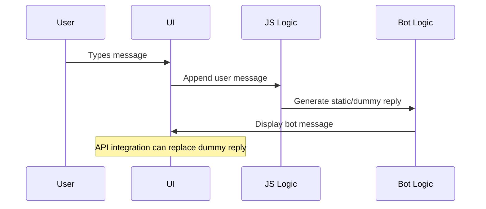

#  **Basic Chatbot (Frontend-Only Chat UI Demo)**

A simple, lightweight chatbot UI built with **HTML, CSS, and JavaScript**, demonstrating message handling, user interaction, and a clean chat-style interface.
Perfect as a starter UI for integrating APIs, LLMs, or backend chatbot systems.

 **Live Demo:** [https://basic-chatbot-xi.vercel.app](https://basic-chatbot-xi.vercel.app)

 

---

# **Table of Contents**

1. [Overview](#overview)
2. [Features](#features)
3. [Folder Structure](#folder-structure)
4. [How to Run Locally](#how-to-run-locally)
5. [Architecture & Design Decisions](#architecture--design-decisions)
6. [Approach](#approach)
7. [Pipeline / Flow](#pipeline--flow)
8. [Challenges & Trade-Offs](#challenges--trade-offs)

---

#  **Overview**

This project is a **basic chatbot UI** built using:

* **HTML**
* **CSS**
* **JavaScript**

It provides a clean, interactive chat interface where users can type messages and receive pre-defined bot replies.
This project can act as a **starter template** for integrating:

* LLM APIs (OpenAI/Groq/Gemini)
* Backend chat services
* RAG pipelines
* Custom ML/NLP models

Lightweight and beginner-friendly, this repo demonstrates the fundamentals of chatbot UI development.

---

#  **Features**

### ✔ Clean & Modern Chat UI

Styled interface with user and bot message bubbles.

### ✔ Real-Time Interaction

Messages appear instantly with smooth UI updates.

### ✔ Easy to Extend

Replace dummy responses with any backend API.

### ✔ Lightweight

No frameworks — pure HTML, CSS, JS.

### ✔ Deployed on Vercel

Instant loading & global CDN support.


---

#  **Folder Structure**

```
Basic-Chatbot/
│
├── index.html        # Chat UI layout
├── style.css         # Styling for chat interface
└── script.js         # JS logic for message handling
```

---

#  **How to Run Locally**

### **1. Clone the Repo**

```bash
git clone https://github.com/JoshiDeepak08/Basic-Chatbot
cd Basic-Chatbot
```

### **2. Open the App**

Just open the HTML file:

```bash
open index.html
```

or drag it into your browser.

---

#  **Architecture & Design Decisions**

### **1. Pure HTML/CSS/JS Approach**

* No frameworks
* Faster to load
* Beginner-friendly

### **2. Simple Chat DOM Model**

Messages are appended dynamically using JavaScript.

### **3. Easy API Integration**

Replace the dummy response logic with an fetch() call:

```js
fetch("/chat-api")
```

### **4. CSS-Only Responsive Layout**

Ensures compatibility across screens.

---

#  **Approach**

The goal was to create a **minimal chatbot interface** with:

* Clean UI
* Easy extensibility
* Very low setup time
* No build tools or dependency overhead

This repo is ideal as a starting point for:

* LLM chatbot
* Customer support chat
* Support ticket bot
* Onboarding assistant

---

#  **Pipeline / Flow**



---

#  **Challenges & Trade-Offs**

### ⚠ Challenge: No backend

➡ Only static logic possible unless extended manually.

### ⚠ Challenge: No persistence

➡ Chat resets on page refresh.

### ⚖ Trade-Off:

Chose simplicity over complexity to make the UI:

* Easy to understand
* Easy to customize
* Easy to integrate with future AI systems

---
