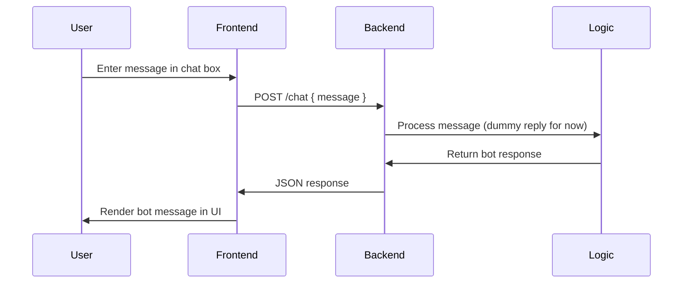

#  **Basic Chatbot (Full-Stack Chatbot Boilerplate — FastAPI + JavaScript UI)**

A minimal full-stack chatbot starter template with a **FastAPI backend** and a **vanilla JavaScript frontend**.
The backend exposes a simple `/chat` API, and the frontend provides a clean chat interface for interacting with the bot. Lightweight, extendable, and perfect for integrating future LLMs, RAG systems, or NLP pipelines.

**Live Demo:** [https://basic-chatbot-xi.vercel.app](https://basic-chatbot-xi.vercel.app)


---

# **Repository Folder Structure**

```
Basic-Chatbot/
│
├── chatbot-backend/
│   ├── main.py              # FastAPI app defining /chat endpoint
│   ├── requirements.txt     # Python dependencies
│   └── __pycache__/         
│
├── chatbot-frontend/
│   ├── public/              # Static assets
│   ├── src/                 # JS, CSS, image assets for the frontend
│   ├── index.html           # Entry point for frontend
│   ├── package.json
│   └── package-lock.json
│
├── README.md                # Documentation
└── .gitignore
```

---

# **How to Run the Project Locally**

---

# **1️⃣ Backend (FastAPI)**

### **Install dependencies**

```bash
cd chatbot-backend
pip install -r requirements.txt
```

### **Run the FastAPI server**

```bash
uvicorn main:app --reload
```

Backend will run on:

```
http://127.0.0.1:8000
```

### **Test the API**

```bash
curl -X POST "http://127.0.0.1:8000/chat" \
    -H "Content-Type: application/json" \
    -d '{"message": "hello"}'
```

---

# **2️⃣ Frontend (Static + JS)**

### **Start the frontend**

If it's a simple static HTML project:

```bash
cd chatbot-frontend
npm install
npm run dev
```

Or simply open:

```
chatbot-frontend/index.html
```

### **Configure frontend API**

Inside your JS file (e.g. `/src/script.js`):

```js
const API_URL = "http://127.0.0.1:8000/chat";
```

---

#  **Architecture & Design Decisions**

### **Why FastAPI Backend?**

* Extremely lightweight
* Easy to extend with ML/LLMs
* Async support
* Fast and deploy-ready

### **Why Vanilla JS Frontend?**

* Zero framework overhead
* Beginner-friendly
* Easy customization
* Perfect for embedding into larger apps

### **Why Two Separate Folders?**

* Backend and frontend decoupled
* Seamless future migration (React/Vue frontend, larger backend)

---

#  **Approach**

The goal was to create a **clean, minimal chatbot architecture** that:

✔ Separates backend logic from UI
✔ Provides a predictable API (`/chat`)
✔ Allows immediate replacement of the bot response with:

* OpenAI / Groq / Gemini
* LangChain RAG pipeline
* Local ML models
  ✔ Supports easy UI redesign or integration into a bigger app
  ✔ Deployable with minimal configuration

---

#  **Pipeline / Flow**



---

#  **Challenges & Trade-Offs**

### **1. Pure JS frontend limits UI complexity**

Trade-off for simplicity and zero setup.

### **2. Backend returns a static/dummy response**

Trade-off for minimal starter template.

### **3. No database or session storage**

Chat resets on refresh → intentional for simplicity.

### **4. CORS configuration required for deployment**

Necessary because frontend and backend are hosted separately.

---
